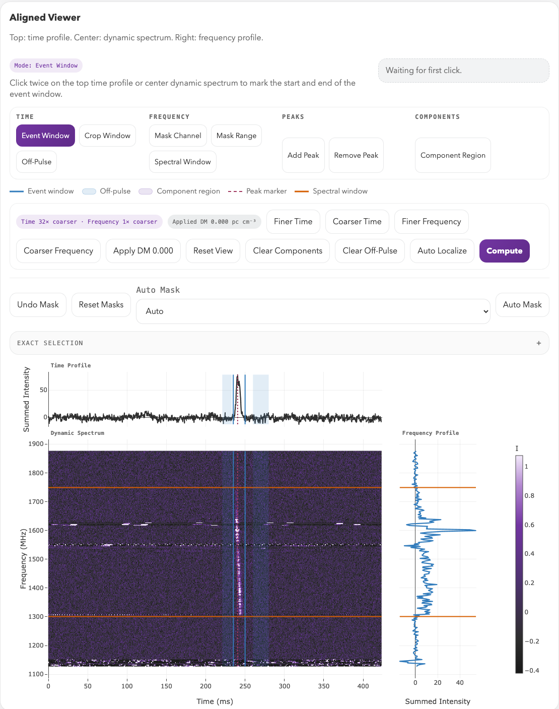

# FLITS

[](https://dirkkuiper.github.io/flits/)
[](https://pypi.org/project/flits/)
[](https://pypi.org/project/flits/)
[](https://github.com/DirkKuiper/flits/actions/workflows/tests.yml)
[](https://pypi.org/project/flits/)
[](https://github.com/DirkKuiper/flits/blob/main/LICENSE)

Fast-Look Interactive Transient Suite.

FLITS is browser-based FRB analysis software for interactive burst
inspection, masking, measurement, DM optimization, temporal/spectral
diagnostics, and export. It reads SIGPROC filterbank (`.fil`),
PSRFITS search/fold data (`.fits`, `.sf`), and CHIME/FRB HDF5 (`.h5`, `.hdf5`)
including public catalog waterfalls and beamformed `BBData`
`tiedbeam_power` files. The I/O layer is pluggable — third parties can
register custom formats via `importlib` entry points without forking.

The selected analysis state is recorded in a JSON session snapshot. Given
the snapshot and original data, `flits replay` restores the selections and
recomputes supported measurements without a browser.



The [guided GBT workflow](https://dirkkuiper.github.io/flits/guided-workflow/)
walks through the selections and results shown in the interface.

## Why FLITS exists

Measuring a detected burst involves selecting an event window and noise
reference, masking interference, choosing a frequency range, and refining the
dispersion measure (DM). These choices affect the resulting measurements and
must be preserved to interpret and reproduce them.

FLITS was built for a repeater campaign spanning GBT at L and P band, Nançay,
Westerbork, Onsala, Stockert, and CHIME. A common reader interface and configurable
telescope presets support analysis across their formats and calibration
conventions. The session retains the selected state so collaborators can
reopen it and recompute supported measurements from the original data.

FLITS builds on specialist search, data-processing, and analysis packages. It
connects measurements through a shared session model with explicit calibration
and uncertainty metadata. Flux and fluence estimates without a supplied SEFD
uncertainty are flagged as having an incomplete uncertainty budget.

FLITS is not a search pipeline — it starts from a burst you already have.

## Quick Start

Install the published package:

```bash
pip install flits
flits --data-dir /path/to/filterbanks --host 127.0.0.1 --port 8123
```

Then open `http://127.0.0.1:8123`.

Optional model fitting uses `fitburst`, which is intentionally left out of the
PyPI dependency metadata because package indexes reject direct URL runtime
dependencies. To enable model fitting after installing
FLITS:

```bash
pip install "fitburst @ https://github.com/CHIMEFRB/fitburst/archive/3c76da8f9e3ec7bc21951ce1b4a26a0255096b69.tar.gz"
```

## Highlights

- Browser-based workflow for burst inspection on SIGPROC, PSRFITS, and CHIME/FRB HDF5 data.
- CHIME support includes public catalog waterfalls and beamformed `BBData` power products.
- Interactive crop, event, off-pulse, spectral-window, and masking controls.
- Automatic burst localization in time and frequency (matched-filter event window, spectral extent, and off-pulse placement in one click).
- Calibrated fluence and peak-flux outputs when an SEFD is available.
- DM optimization using integrated-event S/N and DMphase.
- Temporal-structure, PSD, ACF, and optional selected-event model fitting.
- Sub-burst drift rate in MHz/ms from the mask-corrected 2D autocorrelation, cross-checked against a component-centroid regression, with the drift/DM degeneracy reported as the DM offset that would account for the measured slope.
- Weighted Q/U RM synthesis with optional RM-CLEAN, significance and quality diagnostics, and JSON/CSV products — measured in-session from a full-Stokes burst file, or from an externally prepared Q/U spectrum.
- Export bundles and JSON session snapshots for reproducible analysis.

## Documentation

- Full docs: [dirkkuiper.github.io/flits](https://dirkkuiper.github.io/flits/)
- Getting started: [Quickstart](https://dirkkuiper.github.io/flits/getting-started/)
- Guided example: [GBT Burst Workflow](https://dirkkuiper.github.io/flits/guided-workflow/)
- Installation and deployment: [Installation](https://dirkkuiper.github.io/flits/installation/)
- Developer testing: [Testing](https://dirkkuiper.github.io/flits/developer/testing/)
- Developer publishing: [Publishing](https://dirkkuiper.github.io/flits/developer/publishing/)

The docs cover Python installs, Docker, Apptainer, remote/HPC use, interactive
workflow guidance, measurements, DM optimization, temporal/spectral analysis,
sub-burst drift, exports, and release procedures.

## Release Channels

- PyPI and `ghcr.io/dirkkuiper/flits:latest` track stable releases.
- `ghcr.io/dirkkuiper/flits:<version>` pins an exact release.
- `ghcr.io/dirkkuiper/flits:edge` tracks the current `main` branch for snapshot testing.

## Citation

If you use FLITS in research, cite the software and link to the repository:

- PyPI package: `flits`
- Repository: `https://github.com/DirkKuiper/flits`
- Citation metadata: [CITATION.cff](./CITATION.cff)

## License

FLITS is released under the GNU GPLv3. See [LICENSE](./LICENSE).

The interface bundles [plotly.js](https://github.com/plotly/plotly.js) (MIT) so
it works without fetching anything from a CDN; its licence travels with the copy
in [`flits/web_static/vendor/`](./flits/web_static/vendor/).
