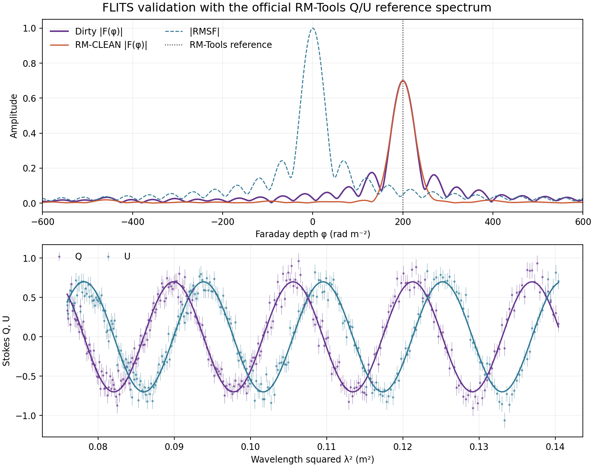

# Rotation-Measure Synthesis

FLITS performs weighted one-dimensional rotation-measure (RM) synthesis on a
channelized complex linear-polarization spectrum, `P = Q + iU`. It retains the
dirty Faraday dispersion function (FDF), the complex rotation-measure spread
function (RMSF), and—when requested—a separate RM-CLEAN reconstruction.

The implementation follows [Brentjens & de Bruyn
(2005)](https://doi.org/10.1051/0004-6361:20052990). RM-CLEAN follows the
one-dimensional deconvolution described by [Heald, Braun & Edmonds
(2009)](https://doi.org/10.1051/0004-6361/200811532).

There are two ways in:

- **From the session**, when the burst file carries four polarization products.
  FLITS builds the Stokes cube, integrates Q and U over the session's own event
  window, takes the channel uncertainties from its off-pulse regions, and drops
  the channels its mask and spectral extent exclude. The result is stored on the
  session, so it travels in snapshots, export bundles and `flits replay` like
  every other analysis.
- **From an imported spectrum**, when Q and U were prepared elsewhere. This path
  is unchanged: import a calibrated channelized Q/U spectrum as JSON or CSV.

## Measuring the RM from the session

### What the file has to carry

A burst file can only yield a Stokes cube if it holds four polarization products
*and* something establishes which four they are. FLITS never guesses: reading
coherency products as though they were Stokes swaps V into Q and produces an RM
that is wrong without looking wrong.

The basis is resolved in this order:

1. an explicit `polarization_basis` on the session (the **Polarization basis**
   control, or the `polarization_basis` argument to `BurstSession.from_file`);
2. the telescope preset, for instruments whose headers are known to misreport
   this — NRT filterbanks carry linear-feed coherency products while the header
   claims `IQUV`;
3. the file header: PSRFITS `POL_TYPE` together with `FD_POLN`.

SIGPROC records nothing about which products a `nifs=4` file holds, so a
filterbank always needs a preset or an explicit basis. If none of the three
settles it, FLITS refuses with `unknown_basis` rather than picking one.

The three recognized bases are:

| Basis | Products | Stokes |
| --- | --- | --- |
| `iquv` | I, Q, U, V | used as-is |
| `coherency_linear` | AA, BB, CR, CI from a linear feed | `I=AA+BB`, `Q=AA-BB`, `U=2CR`, `V=2CI` |
| `coherency_circular` | AA, BB, CR, CI from a circular feed | `I=AA+BB`, `V=AA-BB`, `Q=2CR`, `U=2CI` |

### Browser workflow

Open **Polarization** in the Analysis Workspace and use **Measure From This
Session**. The status line reports how many polarization products the file has
and which basis was established, or what is missing. Set the minimum channel
linear-polarization S/N, confirm the calibration checkbox if the polarization
calibration of this dataset has been established, and click **Measure RM From
Session**.

The measurement uses the session's current selections, so refine the event
window, the off-pulse regions, the channel mask and the spectral extent first —
changing any of them discards the previous result rather than leaving a stale
one on screen.

### Python usage

```python
from flits.session import BurstSession

session = BurstSession.from_file("burst.fil", dm=528.0)
session.set_event_ms(97.4, 104.4)
session.add_offpulse_ms(32.0, 82.0)
session.add_offpulse_ms(120.0, 1200.0)

result = session.run_polarization_analysis({"min_linear_snr": 3.0})
print(result.peak_rm_rad_m2, result.peak_rm_uncertainty_rad_m2)
print(result.linear_fraction, result.circular_fraction)
```

`result.rm_synthesis` holds the full RM-synthesis payload documented below.
The result also records the basis and what established it, the exact event and
off-pulse windows, the channels that survived, and the integrated Stokes I, Q, U
and V spectra — which is what makes it reproducible from the snapshot alone.

### Reading the cube directly

```python
from flits.io import load_stokes_data
from flits.settings import ObservationConfig

config = ObservationConfig.from_preset(dm=528.0, preset_key="nrt")
cube, metadata = load_stokes_data("burst.fil", config)  # (4, channels, time)
```

`load_stokes_data` returns the same time and frequency grid as
`load_filterbank_data` for the same file and config, so a cube can be used
alongside the Stokes-I dynamic spectrum without re-deriving anything. Readers
that cannot produce a cube raise `PolarizationUnavailableError` with a `reason`
of `reader_unsupported`, `insufficient_products` or `unknown_basis`.

Each Stokes parameter has its own off-pulse baseline removed, but all four are
divided by a single per-channel scale taken from Stokes I. Scaling them
independently would rescale Q/I and U/I channel by channel and corrupt every
polarization fraction measured from them.

## Prepare an imported spectrum

RM synthesis needs a calibrated Q/U spectrum, not a Stokes-I dynamic spectrum.
Before importing data:

1. remove the Q and U off-pulse baselines;
2. apply the instrument's polarization and leakage calibration;
3. flag unusable channels consistently in Q and U;
4. integrate the selected burst window into one Q and U value per channel;
5. estimate `sigma_q` and `sigma_u` from suitable off-pulse data; and
6. retain the true channel width for the bandwidth-depolarization limit.

Frequency values are channel centres in MHz. Q, U, and their uncertainties must
use the same units. FLITS can run without uncertainties, but then uses equal
weights and estimates the noise from the residual of the best Faraday-thin
component. This is less reliable for complex sources.

## Browser workflow for an imported spectrum

Open **Polarization** in the Analysis Workspace:

1. Click **Import JSON or CSV**. The analysis runs once immediately with the
   displayed defaults when the input declares `calibration_status: calibrated`.
   Otherwise confirm **Polarization calibration applied** after checking the
   dataset provenance; FLITS deliberately will not run before that confirmation.
2. Review the detected channel count, frequency range, uncertainty status, and
   channel-width status.
3. Adjust the Faraday-depth bounds or step when the automatic coverage is not
   appropriate. Blank fields use the wavelength-coverage defaults.
4. Leave **Apply RM-CLEAN** enabled when RMSF sidelobes need deconvolution. The
   dirty spectrum is always retained.
5. Click **Run RM Synthesis** after changing a setting.
6. Inspect both plots: the FDF/RMSF plot and Q/U with the best Faraday-thin
   model. A high reduced chi-square indicates that one component, the noise
   model, or the calibration does not describe the data.
7. Download the complete result as JSON and the sampled FDF as CSV.

The browser accepts either column-oriented JSON:

```json
{
  "freqs_mhz": [900.0, 901.0, 902.0],
  "stokes_q": [0.12, 0.08, -0.01],
  "stokes_u": [-0.03, 0.09, 0.13],
  "sigma_q": 0.01,
  "sigma_u": 0.01,
  "channel_width_mhz": 1.0,
  "calibration_status": "calibrated"
}
```

or a CSV table. Short aliases such as `frequency_mhz`, `q`, `u`, `q_err`, and
`u_err` are recognized:

```csv
frequency_mhz,q,u,q_err,u_err,channel_width_mhz
900.0,0.12,-0.03,0.01,0.01,1.0
901.0,0.08,0.09,0.01,0.01,1.0
902.0,-0.01,0.13,0.01,0.01,1.0
```

At least eight usable rows are required. The short examples above show the
format only and are not sufficient to run an analysis.

## Python and API usage

```python
from flits.analysis import run_rm_synthesis

result = run_rm_synthesis(
    freqs_mhz=freqs_mhz,
    stokes_q=stokes_q,
    stokes_u=stokes_u,
    sigma_q=sigma_q,
    sigma_u=sigma_u,
    channel_width_mhz=channel_width_mhz,
    phi_min_rad_m2=-5000,
    phi_max_rad_m2=5000,
    phi_step_rad_m2=1,
    clean=True,
    clean_gain=0.1,
    clean_threshold_sigma=3.0,
    clean_max_iterations=1000,
)

if result.status != "ok":
    raise ValueError(result.message)
```

The same fields are accepted by `POST /api/rm-synthesis`. Uncertainties and
channel widths may be scalars or arrays with one value per channel. Invalid
settings return a structured result status from the Python function; request
schema errors return the usual HTTP validation response.

## Automatic sampling and reported limits

By default FLITS:

- searches from `-max_abs_rm_rad_m2` to `+max_abs_rm_rad_m2`;
- samples the FDF at five points per theoretical RMSF FWHM;
- computes the maximum observable absolute RM from the widest channel in
  wavelength-squared space;
- measures the RMSF FWHM from the actual flagged, weighted channel set (while
  also retaining the ideal uniform-coverage estimate);
- uses the supplied channel widths, or infers local widths from channel-centre
  spacing and emits `channel_width_inferred`; and
- evaluates large transforms in bounded chunks. Grids above 100,001 points are
  rejected with guidance to narrow the range or increase the step.

The peak position is refined between grid samples with a three-point parabolic
fit to FDF power. The nominal Faraday-thin uncertainty is
`RMSF FWHM / (2 × peak S/N)`.

When uncertainties are supplied, FLITS uses inverse complex-variance weights,
propagates the Faraday noise, and reports the reduced chi-square of the best
single thin-component Q/U model. Otherwise it reports residual-MAD noise and
does not claim a chi-square. The global false-alarm probability is an
approximation based on Gaussian Q/U noise and the number of independent
RMSF-sized trials. Real calibration residuals and non-Gaussian noise can make it
too optimistic. [George, Stil & Keller
(2012)](https://doi.org/10.1071/AS11027) show why an 8-sigma threshold is a
safer default for broad RM searches than lower thresholds.

## Interpreting the output

Key fields include:

- `peak_rm_rad_m2` and `peak_rm_uncertainty_rad_m2`;
- `peak_snr` and approximate `false_alarm_probability`;
- measured and debiased peak polarized amplitudes;
- polarization angle at the weighted reference wavelength squared and the
  extrapolated zero-wavelength angle;
- RMSF FWHM and maximum sidelobe;
- effective channel count and maximum single-channel weight, which expose
  fragile results dominated by a small part of the band;
- largest recoverable Faraday scale and maximum observable absolute RM;
- dirty complex FDF, complex RMSF, restored RM-CLEAN FDF, and CLEAN
  components; and
- machine-readable warnings for every important caveat.

!!! warning "A Faraday-depth peak is not automatically an intrinsic source RM"

    FLITS does not calibrate instrumental leakage or position angle, and it
    does not calculate an ionospheric correction. RM-CLEAN removes RMSF
    sidelobes; it does not fix calibration errors, bandwidth depolarization, a
    poor noise model, or unresolved Faraday complexity. Apply those corrections
    upstream and preserve them in the analysis provenance before publishing a
    source RM.

## Reproducible RM-Tools validation example

The checked-in worked example uses the official synthetic one-dimensional
validation spectrum from [CIRADA RM-Tools](https://github.com/CIRADA-Tools/RM-Tools).
It is not an observation or a claim about an astrophysical source. It is a
controlled, analysis-ready Q/U dataset with a reference result from an
independent implementation, which makes it suitable for verifying the entire
FLITS path.

The raw source and reference values are distributed like the GBT guided-workflow
file: as versioned assets on the FLITS `tutorial-data-v1` GitHub release. To
download explicit working copies:

```bash
mkdir -p tutorial-data
curl -L -o tutorial-data/flits-tutorial-rmtools-reference-v1.dat \
  https://github.com/DirkKuiper/flits/releases/download/tutorial-data-v1/flits-tutorial-rmtools-reference-v1.dat
curl -L -o tutorial-data/flits-tutorial-rmtools-reference-values-v1.json \
  https://github.com/DirkKuiper/flits/releases/download/tutorial-data-v1/flits-tutorial-rmtools-reference-values-v1.json
```

Run the validation from the repository root with those files:

```bash
python examples/rmtools_reference_workflow.py \
  --source tutorial-data/flits-tutorial-rmtools-reference-v1.dat \
  --reference tutorial-data/flits-tutorial-rmtools-reference-values-v1.json
```

With no file arguments, the script first looks under the ignored local
`data/RM-Tools` directory and otherwise downloads the same release assets.

The script performs the complete reproducibility chain:

1. reads local tutorial files or downloads their versioned FLITS release assets;
2. rejects either file unless its SHA-256 checksum matches;
3. parses all 288 frequency, Q, U, and uncertainty samples;
4. writes [browser-importable JSON](../examples/rmtools-reference-input.json);
5. runs weighted RM synthesis and RM-CLEAN in FLITS;
6. compares RM, peak amplitude, S/N, and channel count with the official
   reference; and
7. fails instead of writing a passing summary when any tolerance is exceeded.

The source covers 800–1088 MHz and is distributed by RM-Tools under the
[MIT license](../examples/rmtools-LICENSE.txt). The pinned source URL, commit,
checksum, upstream URL, FLITS distribution URL, and license URL are retained
inside both generated JSON artifacts.
The data is marked `calibrated` for the browser gate because it is a synthetic
validation product with fully specified Q/U uncertainties; instrument
calibration is not applicable.

The [machine-readable validation summary](../examples/rmtools-reference-summary.json)
records the following independently checked result:

| Quantity | RM-Tools reference | FLITS | Absolute difference |
| --- | ---: | ---: | ---: |
| Peak RM (rad m⁻²) | `200.29004` | `200.28831` | `0.00173` |
| RM uncertainty (rad m⁻²) | `0.24806` | `0.25212` | — |
| Peak amplitude | `0.699674` | `0.699678` | `0.000004` |
| Peak S/N | `118.73860` | `118.73935` | `0.00075` |
| Channels | `288` | `288` | `0` |



The FLITS–RM-Tools RM difference is about 0.7% of the quoted 1σ uncertainty and
well inside the executable example's 0.5 rad m⁻² acceptance limit. The example
also verifies amplitude to 0.001 and S/N to 0.1. Tests rerun the checked-in
browser input through FLITS, so documentation cannot silently drift away from
the implementation.
