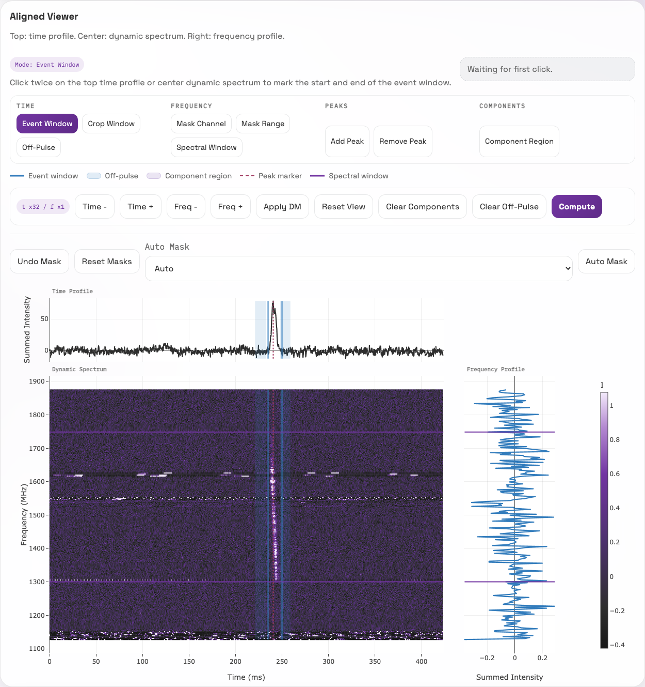
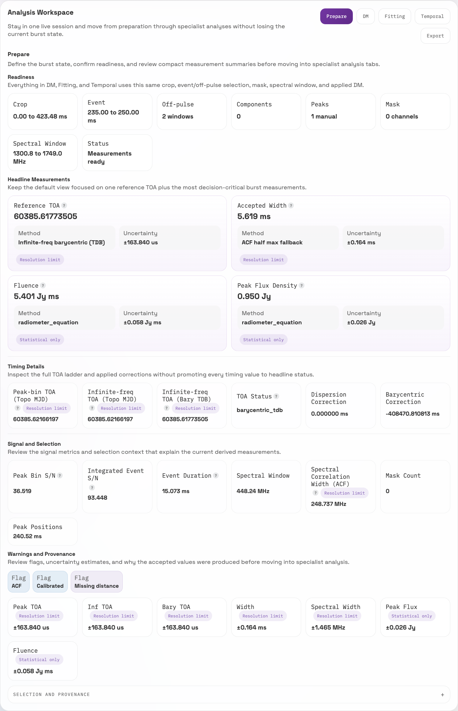
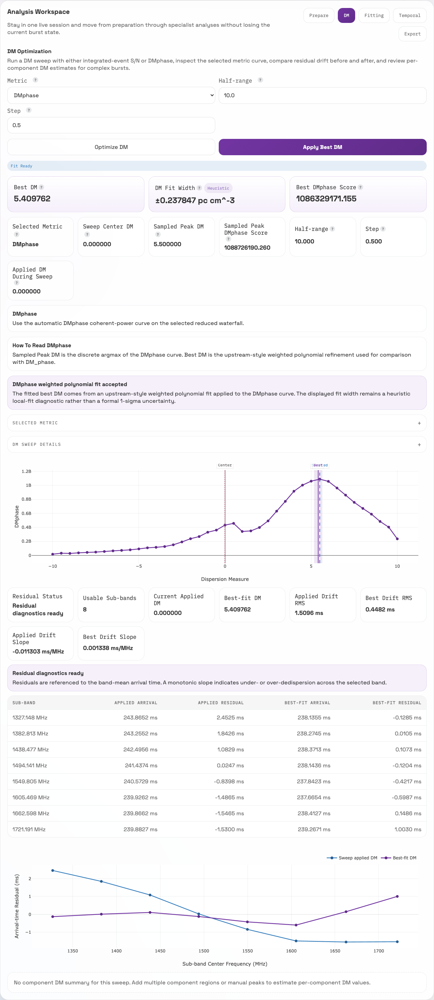
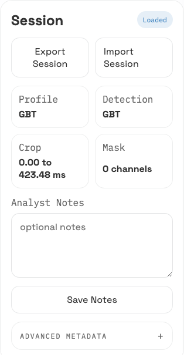

# Guided Workflow: GBT Burst

This walkthrough follows a single GBT-L burst from loading through preparation,
measurements, width comparison, DM optimization, temporal diagnostics, fitting,
and export.

The example file is a SIGPROC filterbank from `DIAG_FRB20240114A`:

`blc_s_guppi_60385_53711_DIAG_FRB20240114A_0057_1673.964_1675.753_b32_I0_D527_851_F256D_K_t30_d1.fil`

The filename records `D527_851`, but this cutout is already dedispersed. Load it
with `DM = 0` in FLITS. Use the DM tab later only as a local residual/refinement
diagnostic around zero.

## 1. Download the tutorial burst

```bash
mkdir -p tutorial-data
curl -L -o tutorial-data/flits-tutorial-gbt-frb20240114a-v1.fil \
  https://github.com/DirkKuiper/flits/releases/download/tutorial-data-v1/flits-tutorial-gbt-frb20240114a-v1.fil
```

For development checkouts that already have the ignored local data directory,
the source file is:

```text
data/GBT-L/blc_s_guppi_60385_53711_DIAG_FRB20240114A_0057_1673.964_1675.753_b32_I0_D527_851_F256D_K_t30_d1.fil
```

## 2. Start FLITS

```bash
flits --data-dir ./tutorial-data --host 127.0.0.1 --port 8123
```

Open `http://127.0.0.1:8123`.

In the loader:

1. Select `flits-tutorial-gbt-frb20240114a-v1.fil`.
2. Enter `0` for DM.
3. Leave the preset on the detected `GBT` setting.
4. Load the session.

Expected first-session checks:

- `256` channels
- full time span of about `423 ms`
- native sample time of `10.24 us`
- default plotted time bins reduced by `x32`, or `327.68 us`
- GBT calibration preset with `10 Jy` SEFD
- the bright burst is near `240 ms`



## 3. Prepare the burst

Use the Prepare controls to focus the analysis state before interpreting any
numbers.

Set:

- event window: `235` to `250 ms`
- off-pulse windows: `221` to `233 ms`, and `248` to `259 ms`
- spectral window: `1300` to `1750 MHz`
- masks: optionally click 'Auto Mask' once

## 4. Compute measurements

Click **Compute** after the event, off-pulse, and spectral windows are set.

The exact values can shift slightly with selection quantization, but the result
should be close to:

| Quantity | Expected value |
| --- | ---: |
| Peak S/N | `~36.5` |
| Integrated event S/N | `~93.4` |
| Fluence | `~5.4 Jy ms` |
| Peak flux density | `~0.95 Jy` |
| Peak topocentric TOA | `~60385.62166196854 MJD` |
| Infinite-frequency topocentric TOA | `~60385.62166196854 MJD` |
| Barycentric TDB TOA | `~60385.61773505590 MJD` |

Because the session DM is `0`, the infinite-frequency correction is `0 ms` and
the peak and infinite-frequency topocentric TOAs are the same. The expected
measurement flags are `calibrated`, `acf`, and `missing_distance`; the distance
flag is normal unless you provide a distance or redshift.



## 5. Run a local DM sweep

Open the **DM** tab and run a DMphase sweep with:

- center DM: `0`
- half range: `10.0`
- step: `0.5`
- metric: `DMphase`

Expected checks:

- best DM near `5.41 pc cm^-3`
- sampled best DM near `5.5 pc cm^-3`
- fit status: `dmphase_weighted_polyfit`
- residual status: `ok`



## 6. Export the session for reproducibility

Use **Save Session** in the sidebar after the event window, off-pulse windows,
spectral window, mask state, measurements, and DM sweep are where you want them.

The saved JSON snapshot stores the interactive session state, not just the final
values. FLITS writes it into a `snapshots/` folder next to the source data so the
analysis can be reopened later from **Saved Sessions** and inspected from the
same crop, selection, masking, calibration, notes, and analysis state. Use
**Download JSON** only when you need a portable copy outside the snapshot
library.


