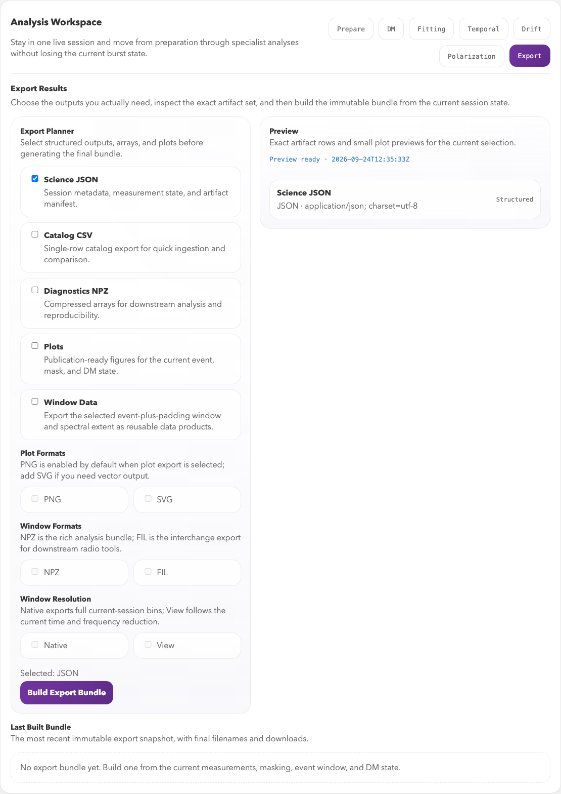
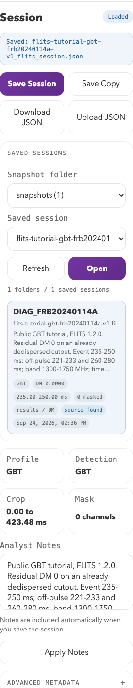

# Exports and Snapshots

FLITS supports both export bundles and full session snapshots.

## Export bundles

Use the export workflow when you want shareable outputs such as:

- structured JSON results
- plots
- analysis windows
- catalog-style artifacts
- array-based products

The export preview helps you see what is currently available from the session
state before downloading anything.



*Choose output types on the left and inspect the exact artifact list on the
right. **Build Export Bundle** creates the selected products from the current
session state.*

## Session snapshots

Session snapshots capture the analysis state itself rather than just the final
outputs. They are useful for:

- pausing and resuming work
- sharing a reproducible interactive state
- archiving the exact crop/mask/selection choices used in an analysis

Use **Save Session** to write the current session next to the source data in a
`snapshots/` folder. If the session was opened from an existing saved snapshot,
**Save Session** updates that JSON file. Use **Save Copy** when you want a
timestamped copy instead. The **Saved Sessions** browser can search stored
snapshots by source, file name, note text, preset, and DM, then reopen a
matching session directly.



*The Session panel saves or reopens the full interactive state. **Download JSON**
makes a portable snapshot; the Export tab above builds derived artifacts.*

Snapshots do not embed the raw filterbank data. To share a snapshot with someone
else, use **Download JSON** or send the saved JSON file and make sure they start
FLITS with `--data-dir` or `FLITS_DATA_DIR` pointing at a directory that
contains the same source data file. FLITS records the source file name,
data-directory-relative path when available, file size, SHA-256 content hash,
and scientific metadata so the import can find moved/copied data and reject the
wrong file.

## File longevity and software versions

Snapshots and science results use JSON; tables use CSV; diagnostic arrays and
selected windows use NumPy NPZ; plots use PNG/SVG; and selected windows can
also be exported as SIGPROC `.fil` files with JSON metadata. NPZ products
contain numeric and string arrays and can be loaded with
`numpy.load(path, allow_pickle=False)`. These products do not depend on
pickled Python classes, and stored values can be inspected without running
the original FLITS analysis.

Reading a stored value and recomputing it are different guarantees. A new
FLITS or dependency version can change a calculation even when the input
file and selections are identical. JSON or HDF5 alone cannot prevent that.

Starting with session schema **1.7** and export schema **1.9**, FLITS captures
the FLITS and Python versions, operating system and architecture, installed
package versions (including optional `fitburst`), and available source
identities. Direct Git installs include their recorded commit; source/archive
installs include available installer metadata. FLITS source is fingerprinted,
with its commit and whether its package files are modified when Git is
available. A schema version identifies the file layout, not this environment.

The `software_provenance` record separates the environment saving the file
(`saved_with`) from the origins of individual `products`. The environment
records are keyed by a SHA-256 of their contents. Reopening a session or
recomputing core measurements preserves the original identity of an older
fit. A failed fit also preserves the provenance of any previously retained
fit values. Inputs from other analyses retain their own identities. Older
files without provenance are marked `not_recorded`; a later save does not
invent their original environment. Replay reports missing or changed
environments, and the interface notifies you on import or reopening.

Science JSON and export manifests carry the full record. CSV has a quoted
`software_provenance_json` column; NPZ has a JSON string array (or includes
it in `window_metadata_json`). PNG/SVG store it in their description metadata.
SIGPROC files must be kept with their `.meta.json` sidecar. Metadata may be
lost if an external image editor rewrites a plot; preserve the original bundle.

Capture occurs once per FLITS process, when its first session is constructed.
Restart FLITS after changing code or packages. Recorded versions describe
installed distributions, not a complete binary/container image; source revisions
can be unavailable for wheels or packages without source metadata. The source
fingerprint covers Python files, not every native library or data dependency.
Local source paths and machine hostnames are omitted; direct URLs have their
userinfo, query, and fragment removed.

Compatibility tests use unmodified serializers from releases 0.2.0, 0.2.1,
1.0.0, 1.1.0, and 1.2.1. Their stored measurements and selections survive
loading. In this regression example, recomputation matches from 0.2.1 onward;
0.2.0 has five known uncertainty-field differences introduced by the 0.2.1
uncertainty-reporting change. Tests also open historical exports with standard
readers. These tests cover specific fixtures, not every possible analysis or
future release. Schema 1.0 cached results are deliberately invalidated, and
unknown future session schemas are rejected before reading the data.

## Recommended practice

For an analysis you intend to publish, preserve:

- The original input data and the session JSON, including its source checksum.
- The export bundle containing the values, arrays, and plots you actually use.
- The exact FLITS release or source commit and the analysis environment:
  Python and dependency versions, including the `fitburst` revision if used.

For example, run these commands **in the environment that performed the
analysis**, and keep their outputs beside the snapshot:

```bash
python --version > python-version.txt
python -m pip freeze --all > environment-requirements.txt
flits --version > flits-version.txt
```

For editable or local source installs, also record the commit and preserve any
uncommitted changes; a package version or local path alone does not identify
that code. Record the operating system and any container image digest used.
An environment listing is provenance, not a complete archive of the software.
Repository dependency pins document tested environments but do not automatically
describe an arbitrary user's installation.

Use [headless replay](headless-replay.md) with `--check` to compare the core
measurements against their saved values. Replay also recomputes recorded width,
drift, and in-session polarization analyses; the drift settings retain the
Monte Carlo random seed. It does not rerun optional model fits, DM scans,
or temporal/spectral structure analyses. Preserve their stored outputs and
their original environment if you need to repeat them.
